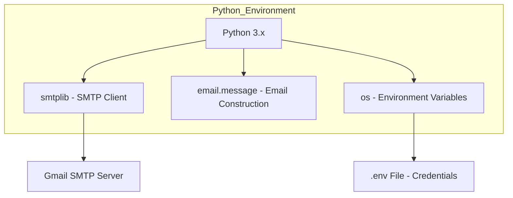
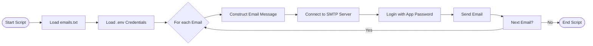

# Email Automation Tool

A lightweight, automated email notification system built with Python. This tool reads a list of recipient emails from a text file and sends automated daily updates using SMTP.

## 🚀 Tech Stack

The project leverages standard Python libraries for automation and security.



## 🔄 Workflow Flowchart

How the automation process works from start to finish.



## 🛠️ Setup & Configuration

1. **Environment Variables**: Create a `.env` file in the root directory with the following:
   ```env
   EMAIL_ADDRESS=your-email@gmail.com
   APP_PASSWORD=your-app-password
   ```

2. **Recipient List**: List your recipient emails in `emails.txt` (one per line).

3. **Usage**:
   ```bash
   python send_email.py
   ```

## 📝 Latest Changes
- Automated daily update content integration.
- Enhanced recipient validation.
- Secure connection using SSL on port 465.